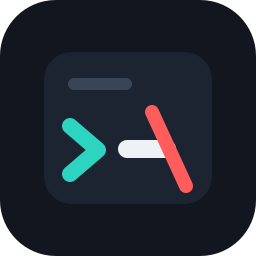
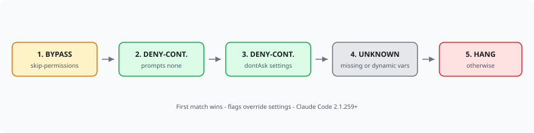

# hangnone

<p align="center">
  
</p>

[](https://github.com/Onur45500/hangnone/actions/workflows/ci.yml)
[](https://www.npmjs.com/package/hangnone)
[](https://nodejs.org)
[](LICENSE)

hangnone finds Claude Code CI jobs that will hang waiting for a permission prompt nobody can answer.

In headless CI there is no human to approve sensitive tool calls. Without the right unattended permission handling, Claude Code either blocks until the runner times out (wasting minutes and producing a useless log) or — in `claude-code-action` — silently auto-denies tools and may still report success. hangnone statically scans your repo and classifies every Claude Code invocation so you can gate CI on clear failures instead of surprise hangs.

> **Not an official Anthropic tool.** hangnone is an independent static analyzer targeting Claude Code CLI behavior as of **v2.1.259+**.

<p align="center">
  
</p>

## Install

Published on npm as [`hangnone`](https://www.npmjs.com/package/hangnone) (`v2.0.0+`).

```bash
# one-shot (recommended in CI)
npx hangnone scan --fail-on hang

# or install the CLI globally
npm install -g hangnone
hangnone scan
```

Requires Node.js 18+.

## Usage

```bash
hangnone scan [path]                      # human-readable table (default: cwd)
hangnone scan [path] --json               # machine-readable output
hangnone scan [path] --fail-on hang       # exit 1 if any HANG finding
hangnone scan [path] --fail-on bypass-unsafe  # fail only on BYPASS with no sandbox signals
hangnone scan [path] --include-ignored    # show # hangnone:ignore suppressions
hangnone scan [path] --strict             # count low-confidence / code findings in --fail-on
hangnone scan [path] --no-include-code    # skip Python/Node subprocess scan
hangnone explain <file> [--line N]        # verbose rule-trace for one file
hangnone fix [path]                       # dry-run: propose --permission-prompts none
hangnone fix [path] --write               # apply unambiguous raw-shell HANG fixes
```

`--fail-on` accepts `hang`, `bypass`, `deny-continue`, `unknown`, and `bypass-unsafe`.

### Suppressing findings

```yaml
# hangnone:ignore
- uses: anthropics/claude-code-action@v1
  with:
    claude_args: "--max-turns 3"

# hangnone:ignore-next-line
- run: claude -p "known false positive"

- run: claude -p "also fine"  # hangnone:ignore
```

## Why this matters

Claude Code normally prompts before sensitive tool use. In CI/cron there is nobody to answer.

| Outcome | What you see | Cost |
| --- | --- | --- |
| Hang | Job sits until the runner timeout | Wasted CI minutes, opaque "timed out" log |
| Silent auto-deny (`claude-code-action`) | Tools refused mid-run; job may still be green | Half-finished work nobody notices |
| Clean deny (`--permission-prompts none` / `dontAsk`) | Immediate permission error | Fast, actionable failure |
| Bypass (`--dangerously-skip-permissions`) | No hang | Security risk unless sandboxed |

hangnone's job is to surface the first three risks before they hit your pipeline.

## Classification decision table

Precedence is top-down (first match wins). Flags override settings files, matching Claude Code's own precedence.

<p align="center">
  
</p>

| Priority | Condition | Classification |
| --- | --- | --- |
| 1 | `--dangerously-skip-permissions` or `bypassPermissions` (flag or settings) | **BYPASS** |
| 2 | `--permission-prompts none` present | **DENY-CONTINUE** |
| 3 | `--settings` / project settings with deny-by-default (`dontAsk`) mode | **DENY-CONTINUE** |
| 4 | `--settings` path missing, or decision-relevant unresolved `$VAR` | **UNKNOWN** |
| 5 | Otherwise (Claude Code invocation with none of the above) | **HANG** |

**HANG reasons are context-aware:**

- Raw `claude -p` / shell / GitLab / CircleCI / Azure / Jenkins → *will hang waiting for a prompt*
- `anthropics/claude-code-action` → *will silently auto-deny tool calls and may report success*

**BYPASS** is enriched with sandbox-signal *heuristics* (bubblewrap, `network: none`, settings `sandbox` / `networkAllowlist`, etc.):

- *BYPASS with sandbox signals present* — signals found nearby; still not a security audit
- *BYPASS with no sandbox evidence* — trips `--fail-on bypass-unsafe`

These heuristics flag presence only. They do **not** prove a sandbox is correctly configured.

## What is scanned

- `.github/workflows/*.yml` — `anthropics/claude-code-action` (`claude_args` / `with:`) and `run:` shell invocations
- `.gitlab-ci.yml` and local includes under `.gitlab/`
- `.circleci/config.yml`
- `azure-pipelines*.yml`
- `Jenkinsfile` (best-effort `sh` string literals)
- `*.sh` scripts with headless-looking `claude` / `claude-code` invocations (best-effort, lower confidence)
- `*.py` / `*.ts` / `*.js` subprocess / `exec` / `spawn` calling Claude (low confidence; excluded from `--fail-on` unless `--strict`)
- Settings files referenced via `--settings` and `.claude/settings.json`

## Auto-fix

`hangnone fix` only rewrites **unambiguous raw-shell HANG** invocations (GHA/GitLab/CircleCI/Azure/Jenkins/`*.sh`) by appending `--permission-prompts none`.

- Dry-run by default; pass `--write` to apply
- Never auto-fixes BYPASS or `claude-code-action` steps

## GitHub Actions gate

```yaml
name: hangnone
on:
  pull_request:
  push:
    branches: [main]
jobs:
  scan:
    runs-on: ubuntu-latest
    steps:
      - uses: actions/checkout@v4
      - uses: actions/setup-node@v4
        with:
          node-version: "20"
      - run: npx hangnone@2 scan --fail-on hang
```

## JSON output

```json
{
  "findings": [
    {
      "file": ".github/workflows/nightly.yml",
      "line": 24,
      "invocation": "claude -p \"...\"",
      "classification": "HANG",
      "reason": "no --permission-prompts none, no dontAsk settings, no bypass flag; will hang waiting for a prompt",
      "confidence": "high"
    }
  ],
  "summary": { "hang": 3, "bypass": 1, "deny_continue": 5, "unknown": 1 },
  "targets": "claude-code >= 2.1.259"
}
```

## Not yet handled

- Full sandbox correctness / network policy verification (heuristics only)
- Live execution of Claude Code to confirm hang behavior
- Other CI platforms (Buildkite, Tekton, etc.)
- GUI / VS Code extension

## Development

```bash
git clone https://github.com/Onur45500/hangnone.git
cd hangnone
npm install
npm test
npm run build
node dist/cli.js scan ./fixtures/01-gha-action-hang
```

See [CONTRIBUTING.md](CONTRIBUTING.md) for PR guidelines, [SECURITY.md](SECURITY.md) for vulnerability reports, [CODE_OF_CONDUCT.md](CODE_OF_CONDUCT.md), and [CHANGELOG.md](CHANGELOG.md) for release notes.

## License

MIT
